This project shows an example web application that leverages Google Authentication using OAuth. 

## Google Web App Setup

In order to authenticate to Google, create an a new project in Google Cloud Console.

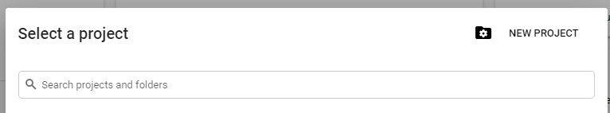

Fill in the Project Name and click Create

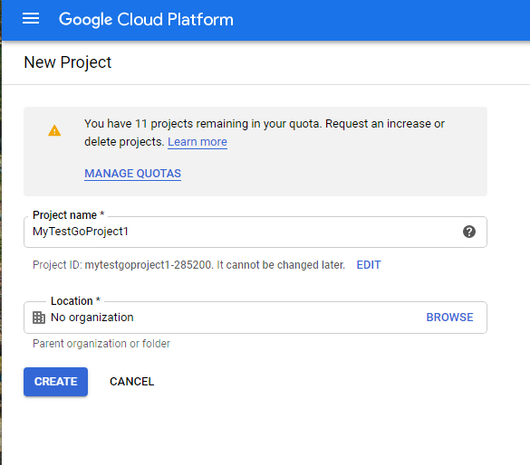

CGP will take few moments to create a project and afterwards will show project created in the notification area.


Click on View project and GCP will switch to that project. Next, Open API & Services and click on Credentials

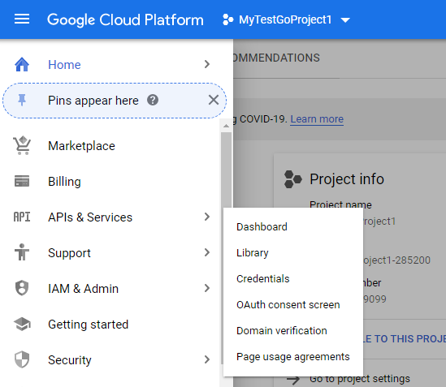

You will see below screen. Then Click on the "Configure Consent Screen"

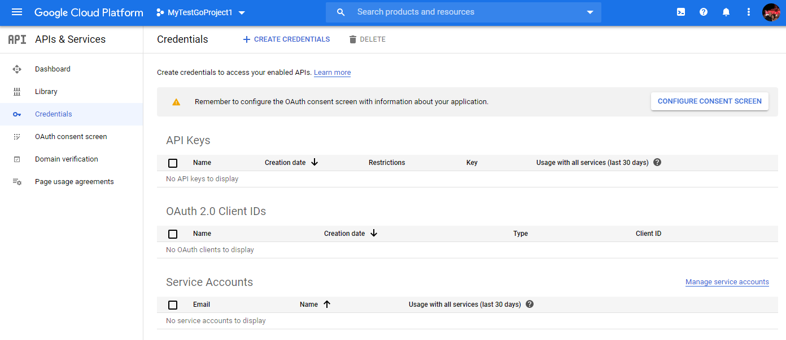


Select External and click on Create

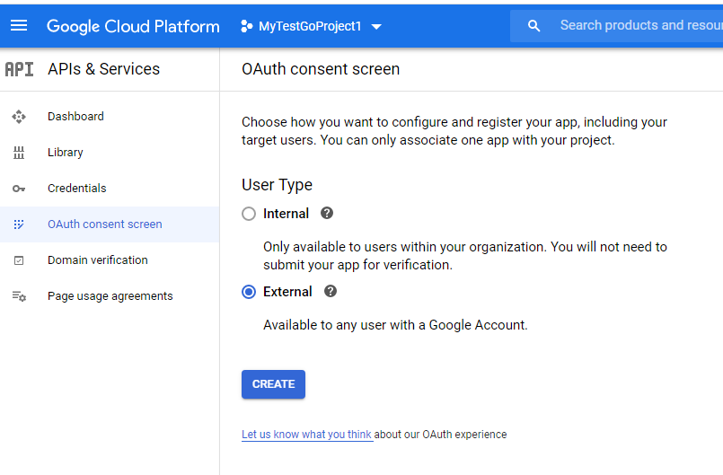


Type in the application name. This is your web app that's asking for the consent on behalf of the user.

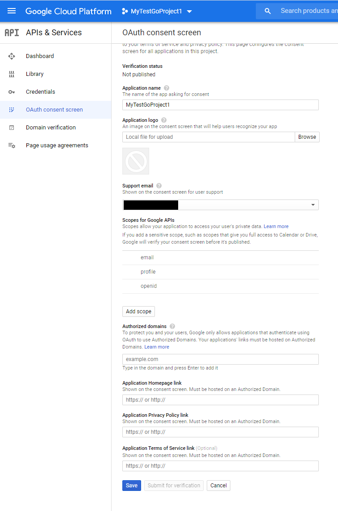


You will land in this screen

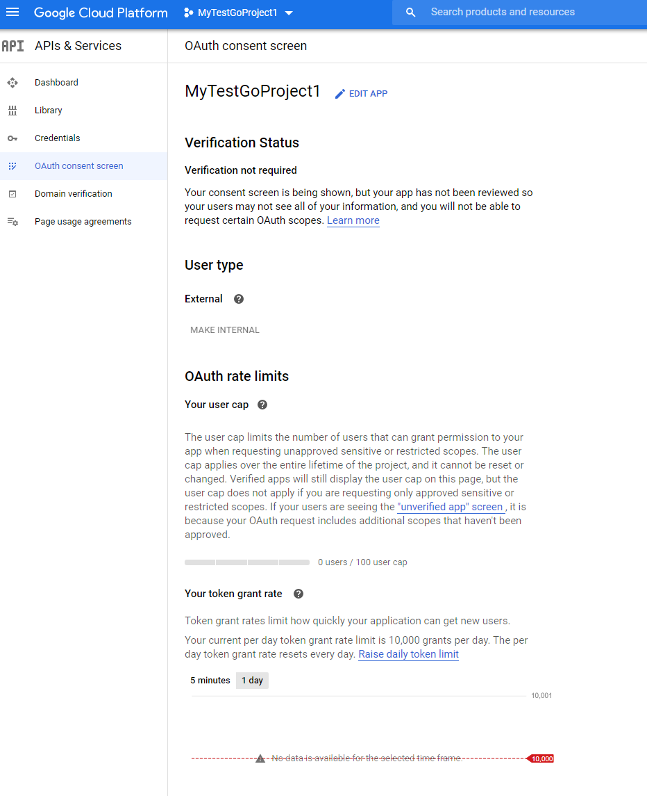

Click on Credentials and click on Create Credentials

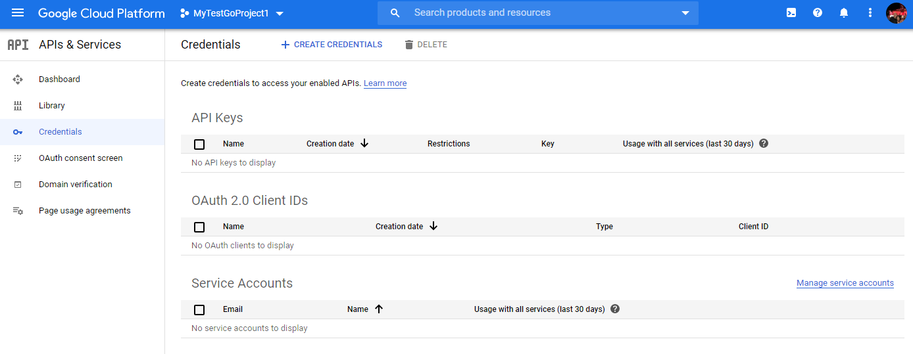


Select oAuth Client ID

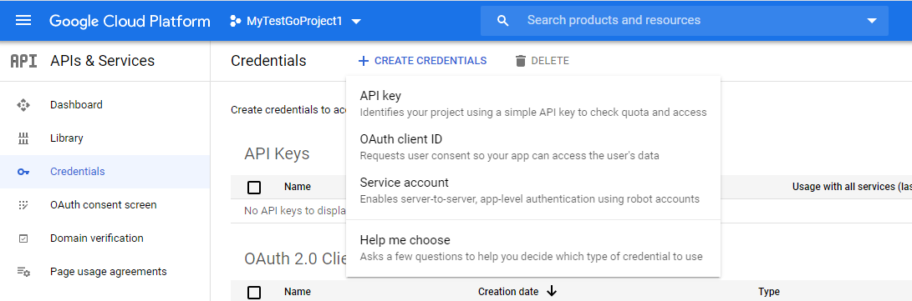

Enter the name and don't forget to supply your callback redirect URL. This is the URL that Google will call back to reply with credential verification. If you're just testing the web app locally, provide http://localhost:8080/callback

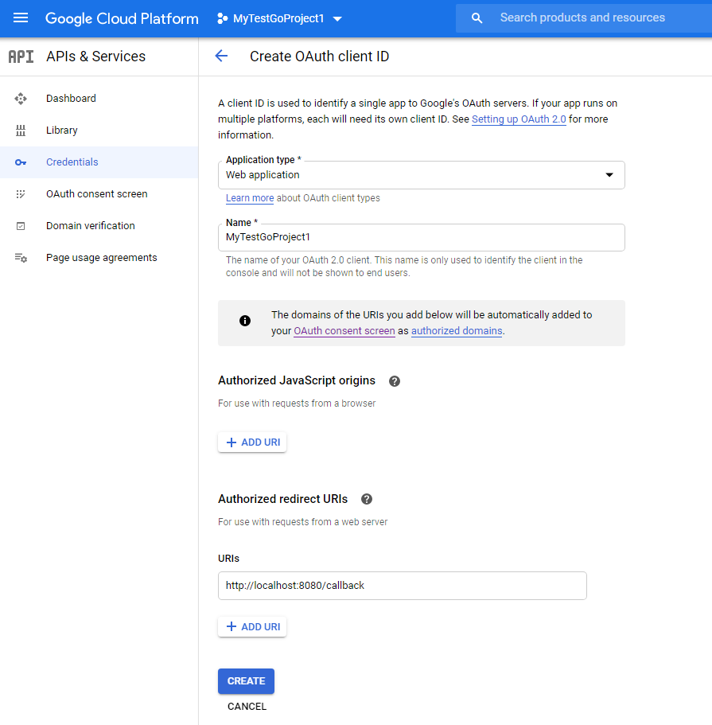

## Web app config

GCP will provide the Client ID and a secret. Copy those and paste in main.go under ClientID and ClientSecret. All other properties for googleOAuthConfig can remain as they are.

```go
googleOAuthConfig = &oauth2.Config{
		RedirectURL:  "http://localhost:8080/callback",
		ClientID:     "1008500429099-mthdau8g506aadi5u9bf9bipmecv0vdt.apps.googleusercontent.com",
		ClientSecret: "0RkJoSOJwNt6kjEl3w7A084t",
		Scopes:       []string{"https://www.googleapis.com/auth/userinfo.email"},
		Endpoint:     google.Endpoint,
	}
```

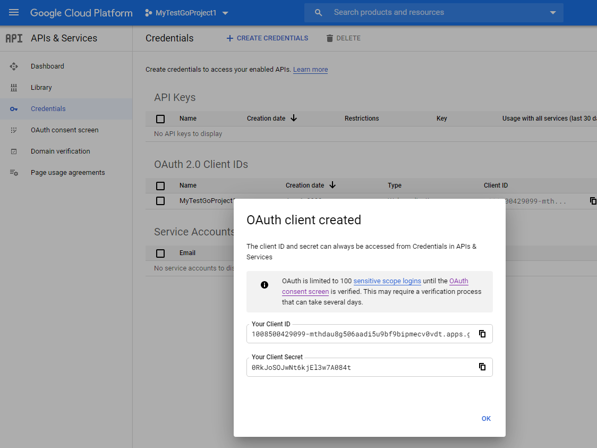

## Run the app

Now start the web app by running: `go run main.go`. Then navigate to http://localhost:8080 and click on Google Login. 


You will be re-directed to google login screen. Login with your Google credentials. 

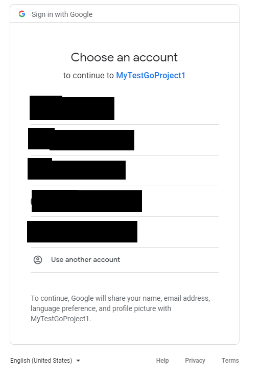


If you authenticated successfully, you will be redirected to a page generated by the web app's handleCallback method. 

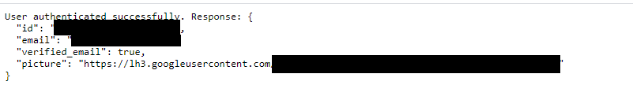


