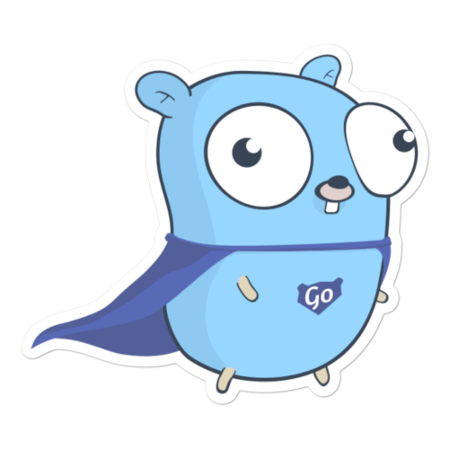

# LearnGo 

## What is this?
The LearnGo project includes various Go basics as well as some patterns and examples. 

## Ceveats
When I started to explore Go, I wanted to have something to refer back to and have some examples I can use. I would keep finding things on the web, but soon forgot about them and had to find them again. As a result, I started to just compile various examples I found useful. I figured I'd share some of these examples in hopes that they could be useful to someone. However, take them with a grain of salt since I'm by no means a Go expert and still feel vey much like a newb. 

## Sections

### Basic modules
Basics includes basic Go examples. It starts with the most basic things like variables and goes deeper including below learning modules. Each module includes various examples. 

- [Variables](https://github.com/vcollak/learnGo/tree/master/basics/1.0_variables)
- [Printing](https://github.com/vcollak/learnGo/tree/master/basics/1.1_printing)
- [Flow Control](https://github.com/vcollak/learnGo/tree/master/basics/1.2_flowControl)
- [Loops](https://github.com/vcollak/learnGo/tree/master/basics/1.3_loops)
- [Arrays](https://github.com/vcollak/learnGo/tree/master/basics/1.4_arrays)
- [Types](https://github.com/vcollak/learnGo/tree/master/basics/1.5_types)
- [Enums](https://github.com/vcollak/learnGo/tree/master/basics/1.6_enums)
- [Slices](https://github.com/vcollak/learnGo/tree/master/basics/1.7_slices)
- [Maps](https://github.com/vcollak/learnGo/tree/master/basics/1.8_maps)
- [Functions](https://github.com/vcollak/learnGo/tree/master/basics/1.9_functions)
- [Closures](https://github.com/vcollak/learnGo/tree/master/basics/2.0_closures)
- [Structs](https://github.com/vcollak/learnGo/tree/master/basics/2.1_structs)
- [Composition and Embedding](https://github.com/vcollak/learnGo/tree/master/basics/2.2_compositionAndEmbedding)
- [Methods](https://github.com/vcollak/learnGo/tree/master/basics/2.3_methods)
- [Pointers](https://github.com/vcollak/learnGo/tree/master/basics/2.4_pointers)
- [Constructors](https://github.com/vcollak/learnGo/tree/master/basics/2.5_constructors)
- [Errors](https://github.com/vcollak/learnGo/tree/master/basics/2.6_errors)
- [Concurrency](https://github.com/vcollak/learnGo/tree/master/basics/2.7_concurrency)
- [Packages](https://github.com/vcollak/learnGo/tree/master/basics/2.8_packages)
- [Variadic Params](https://github.com/vcollak/learnGo/tree/master/basics/2.9_variadicParams)
- [Dates](https://github.com/vcollak/learnGo/tree/master/basics/3.0_dates)
- [Recursion](https://github.com/vcollak/learnGo/tree/master/basics/3.1_recursion)
- [Interface](https://github.com/vcollak/learnGo/tree/master/basics/3.2_interface)

### Patterns
This includes various patterns and examples of common things and how to solve them in Go. 

- [Gorm and SQLite](https://github.com/vcollak/learnGo/tree/master/Patterns/1.1_gormSQLite)
- [Gorm and Postgres](https://github.com/vcollak/learnGo/tree/master/Patterns/1.2_postgres)
- [Mongodb using mgo and mongo driver](https://github.com/vcollak/learnGo/tree/master/Patterns/1.3_mongodb)
- [Docker](https://github.com/vcollak/learnGo/tree/master/Patterns/1.4_docker)
- [JSON](https://github.com/vcollak/learnGo/tree/master/Patterns/1.5_json)
- [Logging](https://github.com/vcollak/learnGo/tree/master/Patterns/1.6_logging)
- [Rate Limiting](https://github.com/vcollak/learnGo/tree/master/Patterns/1.7_rateLimiting)
- [Tickers](https://github.com/vcollak/learnGo/tree/master/Patterns/1.8_tickers)
- [Testing](https://github.com/vcollak/learnGo/tree/master/Patterns/1.9_testing)
- [User Input](https://github.com/vcollak/learnGo/tree/master/Patterns/2.0_userInput)
- [UUID](https://github.com/vcollak/learnGo/tree/master/Patterns/2.1_uuid)
- [Http Get](https://github.com/vcollak/learnGo/tree/master/Patterns/2.2_httpGet)
- [Web Servers](https://github.com/vcollak/learnGo/tree/master/Patterns/2.3_webServers)
- [gRPC](https://github.com/vcollak/learnGo/tree/master/Patterns/3.4_gRPC)
- [oAuth to Google](https://github.com/vcollak/learnGo/tree/master/Patterns/3.5_oAuthGoogle)

## Running Locally
To run these examples locally, just clone them in your GOPATH using: 
`git clone https://github.com/vcollak/learnGo`